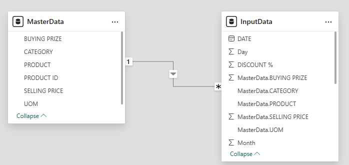
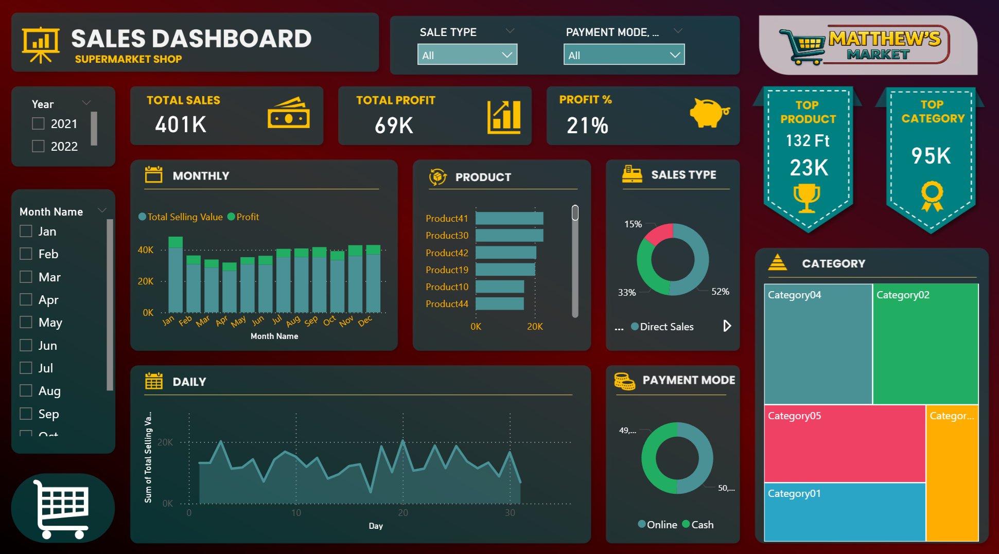

# sales_analysis_supermarket
Power BI sales performance dashboard based on two years of supermarket sales data, integrating custom data modeling, DAX measures, product level performance tracking, and profitability analysis within an interactive BI environment.


## 🎯 Project Goal

The goal of this project was to build a clear and business-focused Power BI sales dashboard based on two years of supermarket data (2021–2022).

The main objectives were:

- Monitor core KPIs such as Total Sales, Total Profit, and Profit %
- Compare performance between 2021 and 2022
- Analyze monthly and daily sales trends
- Identify top-performing products and categories
- Understand sales distribution by payment method and sales type
- The project focuses on clean data modeling, logical report structure, and business clarity rather than complex DAX logic because I had clear small dataset. The goal was to simulate a practical management dashboard used for operational monitoring and performance evaluation.


## 📊 Data Source

The dataset used in this project was simulated for educational and portfolio purposes.
It does not represent real company data.

The dataset consists of two primary tables: a transactional sales table and a product/category dimension table. 
It was synthetically generated to simulate a supermarket retail environment covering two years of operations.


## Sales (Fact Table)

Contains transaction-level sales records.
Each row represents a single sales transaction.

Key fields:

- Order ID – unique transaction identifier
- Order Date – transaction date
- Year – sales year (2021–2022)
- Month Name – month of transaction
- Sales Type – type of sale (Direct Sales)
- Payment Mode – payment method (Cash, Online)
- Product ID – product reference key
- Quantity – number of units sold
- Unit Price – selling price per unit
- Unit Cost – cost per unit
- Total Selling Value – total revenue per transaction
- Total Buying Value – total cost per transaction


This table serves as the analytical core for revenue, cost, profit, margin calculations, and time based analysis.

## Product (Dimension Table)

Contains descriptive product and category information.
Each row represents a unique product.

Key fields:

- Product ID – unique product identifier
- Product Name – product label used in reporting
- Category – product category classification

This table enables:

- Product performance ranking
- Category - level aggregation
- Top product and top category analysis
- Tree map visualization and segmentation

## 🛠 Tools & Technologies

**Excel**
Performed structured data validation, integrity checks, and preliminary preparation to ensure analytical readiness before integration into the BI model.

**Power BI**
Designed and implemented a relational data model (star schema approach), developed DAX measures for profitability and KPI tracking, and built an interactive executive level dashboard supporting performance analysis and decision making.

**AI Assisted Design (ChatGPT)**  
Generated visual branding assets (logo) for portfolio presentation purposes.


## 🧱🧹 Data Preparation & Modeling

**Excel – Data Quality Checks**

Before importing the dataset into Power BI, an initial validation step was carried out in Excel to review the structure and completeness of the data.
The following checks were performed:
Identification of missing values in key fields (Order Date, Total Selling Value, Total Buying Value, Quantity, Sales Type, Payment Mode).

Data type verification:

- Order Date formatted as Date
- Total Selling Value and Total Buying Value set as Decimal Number
- Quantity defined as Whole Number
- Order ID and Product ID stored as Text
- Logical consistency validation performed (no negative quantities, no inconsistencies between selling and buying values)

The objective was to ensure accurate and well-structured input data before developing the relational model and few DAX calculations in Power BI.


**Power BI – Data Transformation & Analytical Modeling**

Instead of creating a separate Date Table in DAX, time-related attributes were derived directly from the existing Date column to enable period-based analysis in visuals and slicers.

Created date attributes (Power Query):

Year
Month (number)
Month Name
Day (day of month)

This approach provided the necessary time context for filtering and trend analysis without adding an additional calendar table.

Core DAX Calculations (KPIs & Profitability)
Basic financial measures were created in DAX to support revenue, cost, and margin reporting:
```
- Total Buying Value = QUANTITY * MasterData.BUYING PRIZE
- Total Selling Value = QUANTITY * MasterData.SELLING PRICE * (1 - DISCOUNT %)
- Profit = Total Selling Value - Total Buying Value
- Profit % = Profit / Total Buying Value
```


## 🔗 ER Diagram

The data model consists of two tables connected by a one-to-many relationship.
MasterData stores product details (category, prices, UOM), while InputData contains transactional sales records.
The relationship ensures consistent product information across transactions and supports accurate sales and profit analysis.




## 📊 Exploratory Business Analysis (Power BI)

This dashboard was designed to simulate a management-level performance reporting environment based on two years of supermarket sales data (2021–2022).
The analysis focuses on identifying revenue drivers, profitability structure, and operational patterns.

🧾 Sales Overview



🔎 Analytical Scope

- KPI monitoring (Total Sales, Total Profit, Profit %)
- Year-over-Year comparison (2021 vs 2022)
- Monthly revenue and margin trend analysis
- Daily sales volatility assessment
- Product level performance ranking
- Category revenue concentration
- Sales type contribution
- Payment mode structure

💡 Analytical Insights

- The business generated 401K in revenue with a 21% profit margin, indicating stable cost control relative to selling price.
- Sales performance remains structurally consistent across months, with stronger results in the later periods, suggesting seasonal uplift.
- Revenue concentration is visible at product level, where a limited number of SKUs drive a significant share of total sales, indicating dependency risk and potential portfolio optimization opportunity.
- Category contribution analysis shows revenue clustering in selected segments, supporting targeted assortment strategies.
- Sales type distribution highlights operational reliance on Direct Sales.
- Payment structure is balanced between Online and Cash, reducing channel concentration risk and increasing operational flexibility.
- Daily sales variability remains within a controlled range, suggesting stable demand without extreme spikes or operational stress.


## 📝 Business Insights & Conclusions

- The supermarket generated in 2 years 401K in total sales with 69K total profit, resulting in a 21% profit margin, indicating a healthy and controlled profitability structure.
- Sales performance remains relatively stable throughout , with visible monthly consistency and moderate fluctuations.
- Profit follows revenue trends proportionally, suggesting stable cost control and pricing discipline.
- Revenue concentration is visible within a limited number of top performing products, indicating partial dependency on key SKUs.
- Category04 and Category02 dominate overall contribution, representing the largest share of revenue within the portfolio.
- Sales Type distribution shows that Direct Sales account for the majority (52%), highlighting a structurally centralized selling model.
- Payment Mode is almost evenly split between Online and Cash, indicating balanced channel behavior and low dependency risk.
- Daily sales patterns show natural volatility but no structural decline, suggesting stable operational demand.

Strategic Interpretation:

- The business demonstrates a balanced revenue structure with controlled margin performance.
- Sales are moderately concentrated across specific categories and products, which supports scale efficiency but may increase exposure risk.
- The model appears volume driven with stable operational consisten

## 💼 Business Recommendations

- Diversify product portfolio contribution to reduce dependency on top SKUs.
- Strengthen high performing categories (Category04, Category02) through targeted assortment expansion.
- Maintain balanced online and cash payment strategy to preserve channel flexibility.
- Introduce targeted promotions in lower performing months to smooth seasonal volatility.
- Explore upselling and cross selling strategies within top categories to improve margin beyond 21%.

